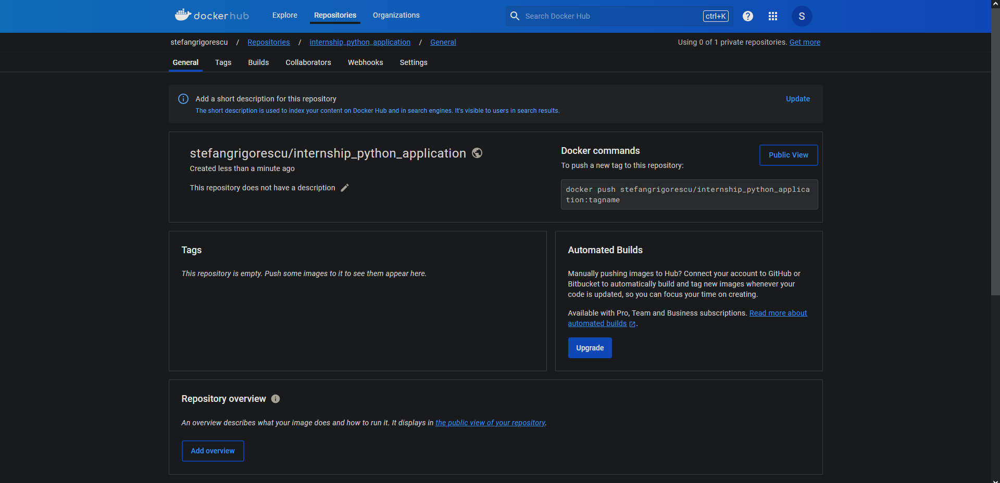

# I decided to go with the python application
```python
import os

def main():
    env_var = os.getenv('MY_ENV_VAR', 'User')
    print('Hello, ' + env_var + '!')

if __name__ == "__main__":
    main()

```
# Create a Dockerfile

I created a Dockerfile in order to containerize the application. I chose the latest python image i found on Docker Hub.
The work directory is the one the application is currently in, and it's also the name of the file in which the application itself will be copied into once the container was created. At last i will call the command `python3 app.py` in order to run the application.  
I need to mention that i did not add a `requirements` command as the application didn't have any external libraries it needed.
```dockerfile
FROM python:3.13.0a4-slim-bullseye

WORKDIR /secondExercise

COPY . /secondExercise

CMD ["python3", "app.py"]
```

# Local Testing
Here you can see the terminal. The dockerfile was successfully created, started, and the application that finished its execution.
```
C:\Users\Stefan\Desktop\InternshipTasks\secondExercise>docker build -t python-application .
[+] Building 0.4s (8/8) FINISHED                                                                         docker:default
 => [internal] load build definition from Dockerfile                                                               0.0s
 => => transferring dockerfile: 155B                                                                               0.0s
 => [internal] load metadata for docker.io/library/python:3.13.0a4-slim-bullseye                                   0.0s
 => [internal] load .dockerignore                                                                                  0.0s
 => => transferring context: 2B                                                                                    0.0s
 => [1/3] FROM docker.io/library/python:3.13.0a4-slim-bullseye                                                     0.1s
 => [internal] load build context                                                                                  0.1s
 => => transferring context: 544B                                                                                  0.0s
 => [2/3] WORKDIR /secondExercise                                                                                  0.0s
 => [3/3] COPY . /secondExercise                                                                                   0.0s
 => exporting to image                                                                                             0.0s
 => => exporting layers                                                                                            0.0s
 => => writing image sha256:359e4ddae5bccbedd3d6ac04e02c17d2ef3be2a9eb8a194478c716c47898bc85                       0.0s
 => => naming to docker.io/library/python-application                                                              0.0s

View build details: docker-desktop://dashboard/build/default/default/uv9tiyjhah9onw22goshmcsra

What's Next?
  1. Sign in to your Docker account → docker login
  2. View a summary of image vulnerabilities and recommendations → docker scout quickview

C:\Users\Stefan\Desktop\InternshipTasks\secondExercise>docker run -d --name python-docker-application python-application
63f86967cdaaf94a524705dcee94ff1c5565984b74d96039d0bc08bba607aeb2

C:\Users\Stefan\Desktop\InternshipTasks\secondExercise>docker ps
CONTAINER ID   IMAGE     COMMAND   CREATED   STATUS    PORTS     NAMES

C:\Users\Stefan\Desktop\InternshipTasks\secondExercise>docker ps -a
CONTAINER ID   IMAGE                COMMAND            CREATED             STATUS                       PORTS     NAMES
63f86967cdaa   python-application   "python3 app.py"   24 seconds ago      Exited (0) 24 seconds ago              python-docker-application
909b4dd130ee   ubuntu:latest        "/bin/bash"        About an hour ago   Exited (127) 3 minutes ago             InternshipTasks

C:\Users\Stefan\Desktop\InternshipTasks\secondExercise>docker logs python-docker-application
Hello, User!
Hello, User!

C:\Users\Stefan\Desktop\InternshipTasks\secondExercise>
```

# Set Up a Docker Registry 


# Automation